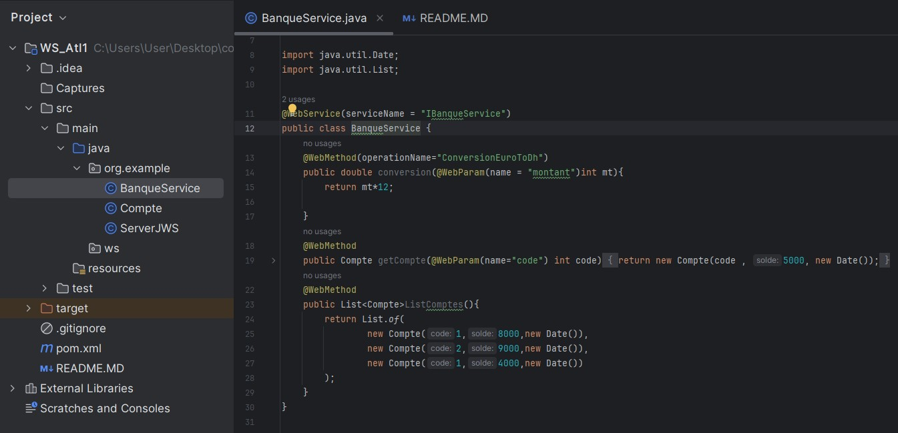
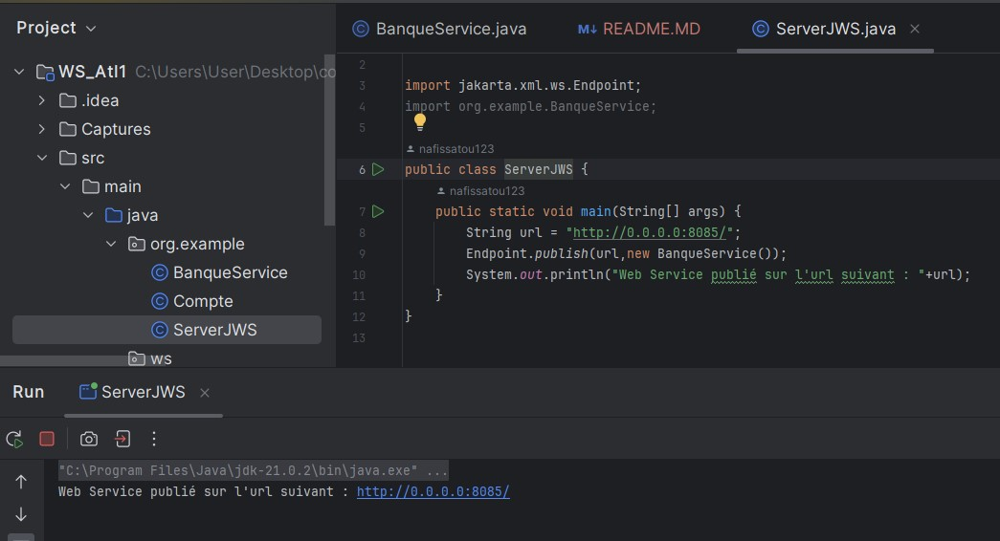
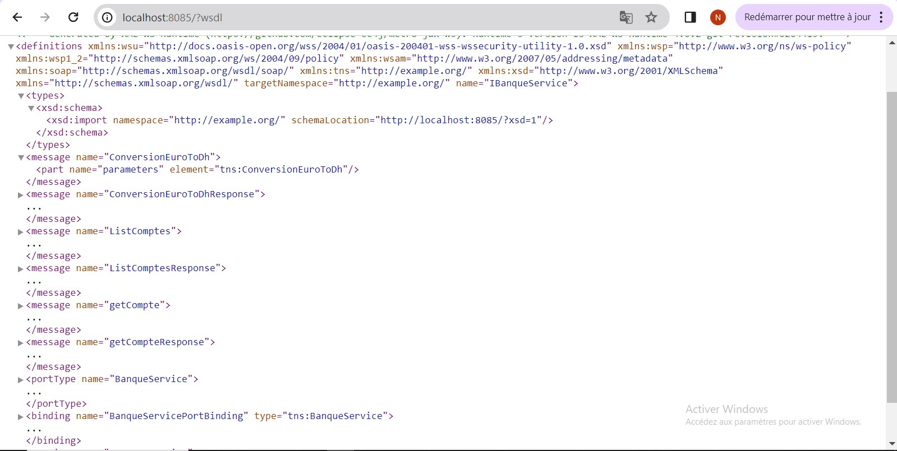
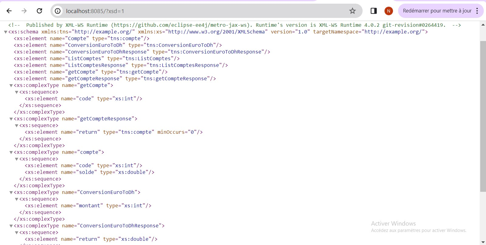
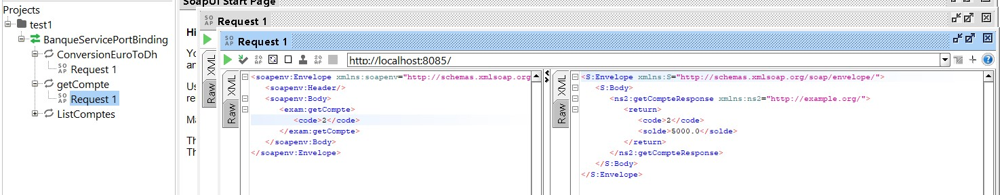
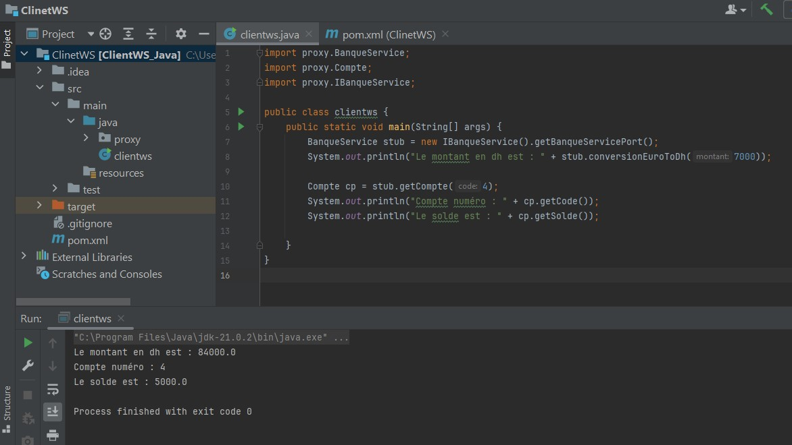

<h2 style="text-align:center; color:blue"> Rendu du TP 1</h2>
<h3>Question 1</h3>

Création du web service.

  

<h3>Question 2</h3>

Déployer le web service avec un simple serveur jaxWS 

  

<h3>Question 3</h3>

Consulter et analyser le wsdl avec un browser

<ul>
<li>Consulter le wsdl avec le browser
 </li>

<li> Analyser le wsdl avec le browser: xsd
 </li>
</ul>

<h3>Question 4</h3>

Tester les opérations du web service avec l'outil SOAPui

<ul>
<li> Méthode : Convertir les euro en dh
 </li>
<li> Méthode : Afficher le compte par code : la date a été ignorée dans l'affichage grace a la notation : @XmlTransient
 </li>
<li> Méthode : Afficher tous les comptes
 </li>
</ul>

<h3>Question 5</h3>

Créer un client SOAP JAVA 

  
